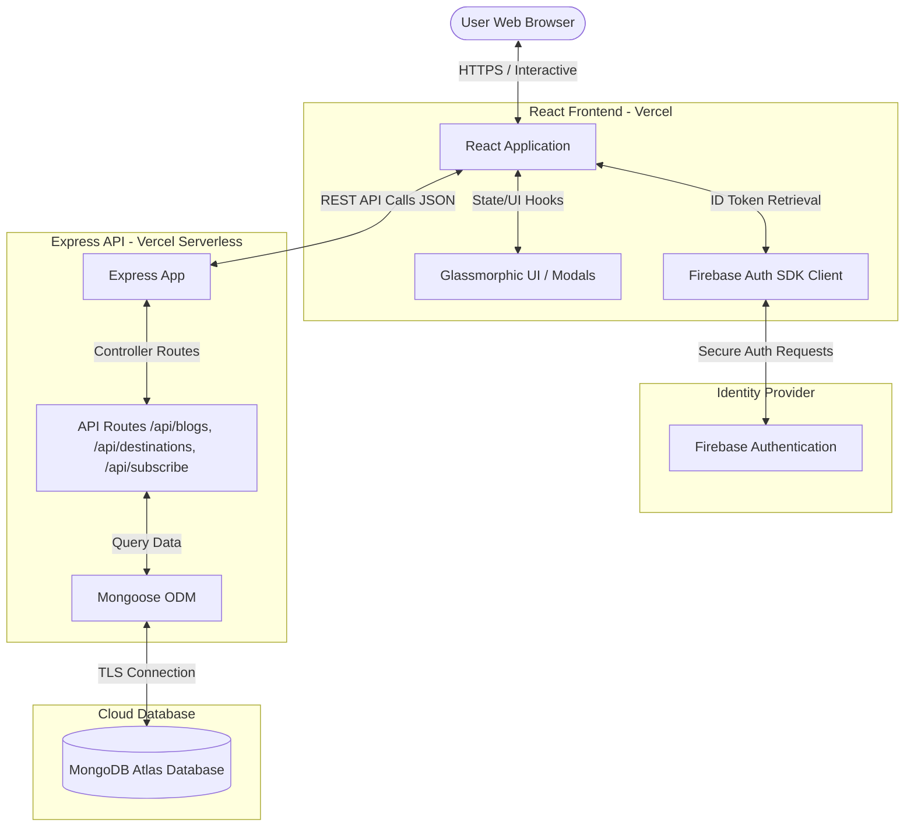

# ✈️ Wanderlust - Premium Full-Stack Travel Blog

[](https://wanderlust-frontend-ten.vercel.app)
[](https://wanderlust-backend-damsathperera1017-8952s-projects.vercel.app)
[](https://mongodb.com)
[](https://firebase.google.com)
[](#)

Wanderlust is a state-of-the-art, premium full-stack travel blog and exploration web application. Designed with modern aesthetics including **glassmorphism**, **custom dark themes with gold accenting**, and **smooth interactive animations**, it provides a stunning user experience. 

The application enables users to discover global travel guides, check interactive destination requirements, sign up/log in securely via Firebase, and register for a curated travel newsletter synced to a live cloud database.

---

## 🗺️ System Architecture

The following diagram illustrates how the frontend React app, Firebase Auth, Node/Express Backend, and MongoDB Atlas interact:



---

## 🌟 Key Features

1. **Premium Glassmorphic UI**: High-end styling utilizing modern CSS custom variables, soft glass backdrops (`backdrop-filter`), glow effects, and golden hues.
2. **Universal Responsiveness**: Engineered and optimized to scale gracefully from massive desktop screens down to high-end mobile phones like the **iPhone 16 Pro** and various Android handsets.
3. **Interactive Destination Modals**: Real-time modal popup overlays detailing crucial travel information including:
   - **Visa Requirements** (e.g., electronic visa vs. visa-free)
   - **Average Travel Costs**
   - **Must-See Spots** & **Local Delicacies**
   - **Safety Ratings**
4. **Firebase Authentication Integration**:
   - Secure Login and Registration forms built with Firebase Auth.
   - Persistent session detection and automatic state transitions.
   - Clean, functional User profile state displaying logout functions.
5. **Newsletter Engine**: Enables visitors to subscribe to travel updates. Subscriptions are validated and securely saved in a cloud database.
6. **Dynamic Travel Checklist & Tips**: Interactive list elements helping travelers prepare their baggage and schedules.

---

## 💻 Tech Stack

### Frontend
- **Framework**: React.js (Scaffolded using Vite)
- **Styling**: Vanilla CSS (Responsive Flexbox/Grid, Custom variables, Glassmorphism, viewport-height rules)
- **State & Services**: Firebase Client SDK v10 (Authentication), Fetch API (REST integration)

### Backend
- **Framework**: Node.js & Express.js (configured as serverless backend functions for Vercel deployment)
- **Database Wrapper**: Mongoose (ODM)
- **Middleware**: CORS (Cross-Origin Resource Sharing), Express JSON Parser, dotenv

### Cloud Infrastructure
- **Database**: MongoDB Atlas (Cloud NoSQL database instance)
- **Authentication Service**: Firebase Console Authentication (Email/Password & User database)
- **Web Hosting**: Vercel (Front-end SPA and Serverless Functions API)

---

## 📊 Database Schemas

The MongoDB cloud database contains three core collections defined via Mongoose models:

### 1. Destination Schema (`backend/models/Destination.js`)
Stores detailed information for featured travel locations.

| Field | Type | Required | Description |
| :--- | :--- | :--- | :--- |
| `name` | String | Yes | Name of the destination (e.g., Kyoto) |
| `shortName` | String | Yes | Short identifier tag |
| `tagText` | String | Yes | Mini description tag (e.g., "Cultural Sanctuary") |
| `img` | String | Yes | Destination card backdrop image url |
| `country` | String | Yes | Country name |
| `description`| String | Yes | Detailed introductory paragraph |
| `bestTime` | String | No | Recommended travel months |
| `avgCost` | String | No | Cost indicator (e.g., "$$ (Moderate)") |
| `language` | String | No | Principal spoken language |
| `currency` | String | No | Official local currency |
| `visa` | String | No | Visa specification for global travelers |
| `mustSee` | Array (String) | No | List of landmarks / activities |
| `food` | Array (String) | No | List of must-try dishes |
| `funFact` | String | No | Catchy trivia fact about the place |
| `safety` | String | No | Safety rating information |

### 2. Blog Schema (`backend/models/Blog.js`)
Handles travel articles displayed on the homepage.

| Field | Type | Required | Description |
| :--- | :--- | :--- | :--- |
| `title` | String | Yes | Headline of the blog post |
| `excerpt` | String | Yes | Brief description shown in lists |
| `content` | String | Yes | Full HTML/Text article body |
| `date` | String | Yes | Publication date |
| `readTime` | String | Yes | Estimated time to read (e.g., "5 min read") |
| `img` | String | Yes | High-quality header image url |
| `category` | String | Yes | Blog category (e.g., "Adventure", "Culinary") |

### 3. Subscriber Schema (`backend/models/Subscriber.js`)
Captures marketing and newsletter subscriber records.

| Field | Type | Required | Description |
| :--- | :--- | :--- | :--- |
| `fullName` | String | Yes | Subscriber's full name |
| `idNumber` | String | Yes | Identification document number |
| `contactNumber`| String | Yes | Phone number |
| `email` | String | Yes | Unique contact email address |

---

## 📡 API Reference

The backend exposes the following REST API endpoints:

| Method | Endpoint | Description | Request Body Parameters | Response Status |
| :--- | :--- | :--- | :--- | :--- |
| **GET** | `/api/health` | Diagnostic check endpoint | *None* | `200 OK` |
| **GET** | `/api/destinations` | Fetch all travel destinations | *None* | `200 OK` |
| **GET** | `/api/destinations/:id`| Retrieve single destination | *None* | `200 OK` / `404 Not Found` |
| **POST** | `/api/destinations` | Add a new travel destination | Destination JSON object | `201 Created` / `400 Bad Request` |
| **GET** | `/api/blogs` | Retrieve all blog posts | *None* | `200 OK` |
| **GET** | `/api/blogs/:id` | Retrieve single blog post | *None* | `200 OK` / `404 Not Found` |
| **POST** | `/api/blogs` | Add a new blog post | Blog JSON object | `201 Created` / `400 Bad Request` |
| **POST** | `/api/subscribe` | Register newsletter subscription | `{fullName, idNumber, contactNumber, email}` | `201 Created` / `400 Bad Request` |
| **GET** | `/api/subscribe` | Fetch all registered subscribers | *None* | `200 OK` |

---

## 🛠️ Local Setup & Installation

### 1. Clone the Repository
```bash
git clone https://github.com/Damsath1017/wanderlust-travel-blog.git
cd wanderlust-travel-blog
```

### 2. Configure Backend Server
1. Go to the backend folder:
   ```bash
   cd backend
   ```
2. Install NodeJS libraries:
   ```bash
   npm install
   ```
3. Create a `.env` configuration:
   ```env
   PORT=5000
   MONGO_URI=your_mongodb_connection_string
   ```
4. Populate database with default mock data:
   ```bash
   npm run seed
   ```
5. Run dev server:
   ```bash
   npm start
   ```

### 3. Configure Frontend Client
1. Navigate back to the repository root directory.
2. Install frontend dependencies:
   ```bash
   npm install
   ```
3. Establish environment variable files `.env` or `.env.local` inside the root:
   ```env
   VITE_API_URL=http://localhost:5000/api
   VITE_FIREBASE_API_KEY=AIzaSy...
   VITE_FIREBASE_AUTH_DOMAIN=wanderlust-auth.firebaseapp.com
   VITE_FIREBASE_PROJECT_ID=wanderlust-auth
   VITE_FIREBASE_STORAGE_BUCKET=wanderlust-auth.appspot.com
   VITE_FIREBASE_MESSAGING_SENDER_ID=9876543210
   VITE_FIREBASE_APP_ID=1:9876543210:web:abcdef...
   ```
4. Launch the local Vite development pipeline:
   ```bash
   npm run dev
   ```
5. Open your web browser to `http://localhost:5173`.

---

## ☁️ Cloud Deployments

The live versions of Wanderlust are deployed continuously via Vercel GitHub hooks. 

### Serverless Backend Configuration (`vercel.json`)
The API routes are routed directly to the Express server script (`server.js`) wrapped into Vercel Serverless Functions:
```json
{
  "version": 2,
  "builds": [
    {
      "src": "server.js",
      "use": "@vercel/node"
    }
  ],
  "routes": [
    {
      "src": "/(.*)",
      "dest": "server.js"
    }
  ]
}
```

### ⚠️ Important Deployment Notes:
- **MongoDB Password Encoding**: If your MongoDB Atlas password contains special characters (such as `@`, `#`, `?`, `$`), you **must URL-encode** them in the Vercel environment variable dashboard. 
  - *Example*: `@` becomes `%40`, `#` becomes `%23`, `$` becomes `%24`.
- **CORS Handling**: The backend automatically handles client origins through standard cors middleware. When using production builds, verify the API URL matches the custom or Vercel generated serverless backend endpoint.
- **Firebase Auth Domains**: Remember to whitelist your production frontend domain (e.g., `wanderlust-frontend-ten.vercel.app`) in the Firebase console under **Authentication > Settings > Authorized Domains** so authentication modals operate correctly.

---

## 📱 Mobile Responsiveness Layout Details

The design includes a custom-engineered responsive CSS module. Key layout optimizations at breakpoints `< 768px` (Mobile) and `< 480px` (Compact Mobile / iPhone) include:

- **Adaptive Navigation Header**: The main navigation menu wraps and scales to center items cleanly. Link paddings are adjusted to improve finger-tap targets.
- **Hero Image Adjustments**: The hero background features scaled-down heights to fit portrait orientations on smartphone screens without stretching.
- **Interactive Modals**: Modals are configured with fluid width properties (`width: 92%`), dynamic vertical scroll capabilities for descriptive lists, and large close buttons tailored for touch targets.
- **Grid Layout Collapsing**: The three-column blog preview panels and double-column features collapse into elegant single-column stacks.

---

## 📄 License
This project is open-source software licensed under the [MIT License](LICENSE).
